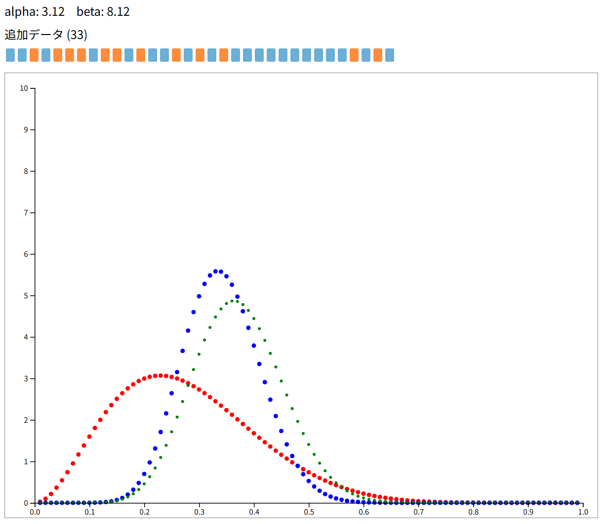

# Bernoulli.learn — インタラクティブ ベータ分布デモ

## 概要
このプロジェクトはベータ分布（Beta distribution）を対話的に学ぶための小さなデモです。ブラウザでSVGグラフを表示し、マウス操作やキーボードでパラメータや観測データを変更して、事前分布（prior）、事後分布（posterior）、尤度（likelihood）がどのように変わるかを視覚的に確認できます。

## 操作方法（READMEの上部スクリーンショット参照）
- マウス：SVGグラフ領域をクリックしてドラッグすると、横方向で `alpha`、縦方向で `beta` を同時に変更できます。画面上に現在の `alpha` / `beta` が表示されます。
- キーボード操作：
  - `A`：観測データに `0` を追加（青い小箱が追加されます）
  - `D`：観測データに `1` を追加（オレンジの小箱が追加されます）
  - `S`：最後に追加したデータを削除（pop）
  - `C`：観測データをすべてクリア

## 図の見方
- 赤：事前分布（prior） — あらかじめ設定したベータ分布（`alpha`, `beta`）
- 青：事後分布（posterior） — 観測データ（0/1）を反映したベータ分布
- 緑：尤度（likelihood） — 観測データの尤度を示すプロファイル

alpha と beta の簡単な意味：
- `alpha` は成功の擬似回数（1 に相当）を示すパラメータ、`beta` は失敗の擬似回数（0 に相当）を示すパラメータです。観測データを追加すると事後分布はそれらを足し合わせた形になります（詳細は `js/main.js` の `getPostParamters` を参照）。
